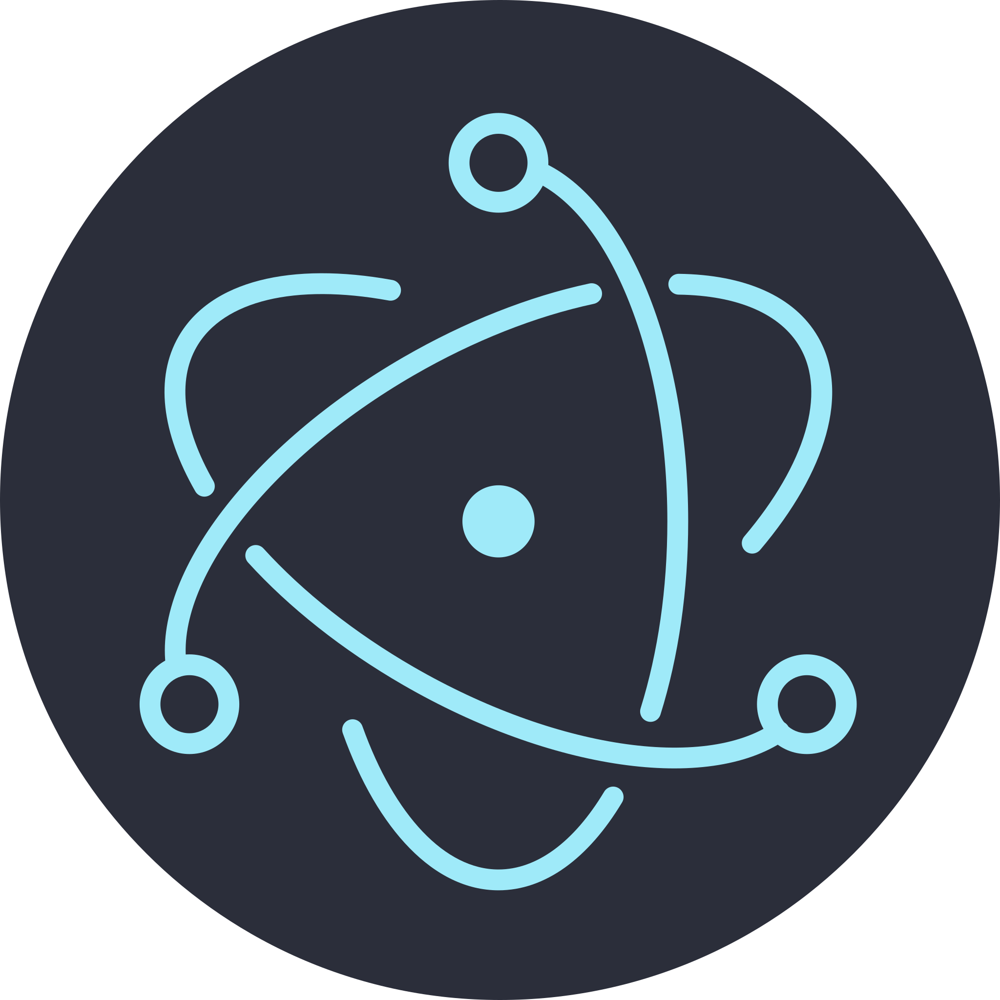

# CURSO DE ELECTRONJS
👨‍⚖️O ELECTRONJS É UM FRAMEWORK DE CÓDIGO ABERTO QUE PERMITE CRIAR APLICATIVOS DE DESKTOP MULTIPLATAFORMA USANDO TECNOLOGIAS WEB COMO HTML, CSS E JAVASCRIPT. ELE PERMITE QUE OS DESENVOLVEDORES CRIEM APLICATIVOS PARA WINDOWS, MACOS E LINUX USANDO AS MESMAS HABILIDADES DE DESENVOLVIMENTO WEB.

  

## CONCEITO:
O Electron é uma estrutura de código aberto que permite criar aplicativos desktop multiplataforma usando tecnologias da web, como HTML, CSS e JavaScript. Ele é amplamente utilizado para desenvolver aplicativos de desktop para Windows, macOS e Linux. Vou explicar alguns conceitos básicos e fornecer exemplos de código para ajudá-lo a entender melhor como o Electron funciona.

1. **Main Process e Renderer Process:**
   O Electron tem dois processos principais: o processo principal (main process) e os processos de renderização (renderer process). O processo principal é responsável por criar a janela do aplicativo e gerenciar eventos de sistema, enquanto os processos de renderização são usados para exibir o conteúdo da interface do usuário.

2. **Páginas da Web como UI:**
   A interface do usuário do seu aplicativo Electron é basicamente construída com páginas da web. Você pode criar interfaces usando HTML, CSS e JavaScript como faria em um site da web.

3. **Node.js Integrado:**
   O Electron integra o Node.js, permitindo que você acesse recursos nativos do sistema operacional e execute código JavaScript no lado do servidor.

4. **Electron API:**
   O Electron fornece uma ampla gama de APIs para interagir com o sistema operacional e criar recursos específicos da área de trabalho, como janelas, bandejas de sistema, notificações e muito mais.

5. **Package.json:**
   O arquivo `package.json` é fundamental em um projeto Electron. Ele descreve as dependências do aplicativo e configurações importantes, como o arquivo principal (main), que define o processo principal do aplicativo.

## SUA HISTÓRIA:
1. **Origens (2013)**:
   - O ElectronJS teve suas origens no projeto Atom Shell, uma iniciativa iniciada por Cheng Zhao da GitHub Inc. em 2013.
   - O objetivo inicial era criar uma plataforma para desenvolver o editor de código Atom de forma mais eficiente e para possibilitar a criação de aplicativos desktop com tecnologias web.

2. **Lançamento Público (2014)**:
   - Em 2014, o Electron foi lançado publicamente como um projeto de código aberto pela GitHub Inc.
   - A ideia principal era permitir que desenvolvedores criassem aplicativos desktop usando HTML, CSS e JavaScript, tecnologias familiares para desenvolvimento web, e distribuíssem esses aplicativos para várias plataformas desktop.

3. **Rápida Adoção (2015-presente)**:
   - Desde o seu lançamento público, o Electron ganhou rapidamente popularidade entre os desenvolvedores devido à sua facilidade de uso, flexibilidade e capacidade de criar aplicativos desktop de alta qualidade.
   - Empresas como Slack, Discord, Microsoft (com Visual Studio Code) e muitas outras adotaram o Electron para seus aplicativos desktop.

## CARACTERISTICAS:
### POSITIVAS:
1. **Multiplataforma:** Um dos principais benefícios do Electron é a capacidade de criar aplicativos desktop para Windows, macOS e Linux usando uma única base de código.

2. **Desenvolvimento Web:** Desenvolver aplicativos com Electron é acessível para desenvolvedores web, pois permite usar tecnologias da web comuns, como HTML, CSS e JavaScript.

3. **Grande Comunidade:** O Electron tem uma comunidade ativa e uma ampla gama de bibliotecas e recursos disponíveis, o que facilita a solução de problemas e o desenvolvimento rápido.

4. **Integração com Node.js:** A integração nativa com o Node.js permite acessar recursos nativos do sistema, como sistemas de arquivos, notificações e muito mais.

5. **Atualizações Simples:** Atualizar aplicativos Electron é relativamente fácil, já que você só precisa atualizar os arquivos de origem, e os usuários receberão as atualizações automaticamente.

6. **Acesso a APIs de Sistema:** O Electron oferece APIs para acessar recursos de sistema, como câmera, áudio, sistema de arquivos, janelas de sistema, e outras funcionalidades de nível de desktop.

### NEGATIVAS:
1. **Consumo de Recursos:** Aplicativos Electron tendem a consumir mais memória e recursos do sistema em comparação com aplicativos nativos, já que estão executando um navegador embutido.

2. **Tamanho do Aplicativo:** Os aplicativos Electron podem ser relativamente grandes em tamanho, o que pode ser um problema se a largura de banda for limitada.

3. **Desempenho Limitado:** Em comparação com aplicativos nativos, os aplicativos Electron podem ser mais lentos em termos de inicialização e desempenho, especialmente para aplicativos intensivos em gráficos.

4. **Dependências de Terceiros:** Eletrons geralmente incluem muitas dependências de terceiros, o que pode tornar a gestão de dependências mais complicada.

5. **Manutenção Contínua:** Você deve acompanhar as atualizações do Electron e suas dependências para garantir a segurança e a compatibilidade com sistemas operacionais.

6. **Experiência do Usuário:** O estilo visual e a experiência do usuário podem ser diferentes da plataforma nativa, o que pode afetar a aceitação dos usuários.

## SUBSIDIOS:
- [CURSO CRIADO PELO "FILIPE MORELLI DEVELOPER"](https://youtube.com/playlist?list=PLWhiA_CuQkbCqT946EXFbvMQhK3oMpCsR&si=tY3L3RFl-mQJK6sn)
- [CURSO FEITO PELO VILHALVA](https://github.com/VILHALVA)
- [VEJA A DOCUMENTAÇÃO](https://www.electronjs.org/docs/latest)
- [LINGUAGEM DE PROGRAMAÇÃO](https://github.com/VILHALVA/CURSO-DE-JAVASCRIPT)
- [VEJA A SINTAXE](./SINTAXE.md)
- [VEJA OS PROJETOS](https://github.com/VILHALVA?tab=repositories&q=topic:ELECTRONJS)

